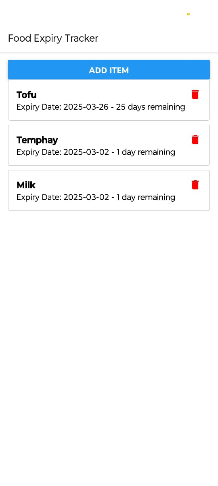
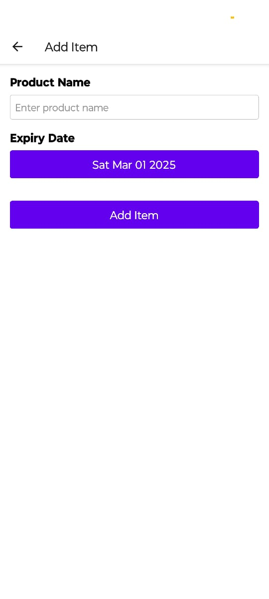
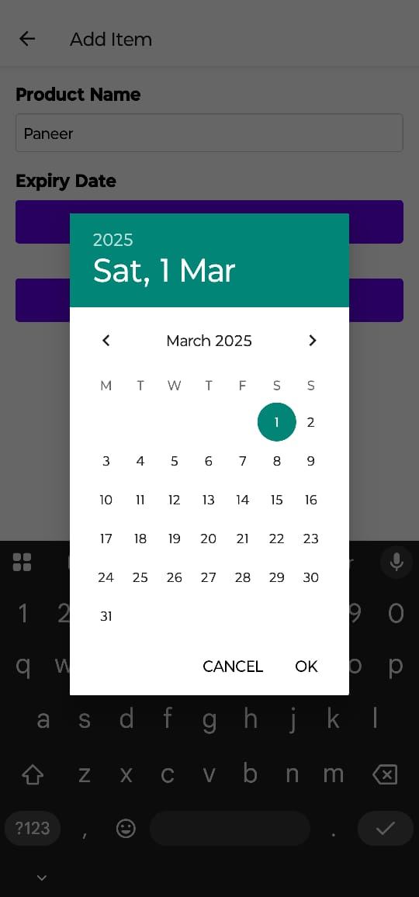

#📌 Project Overview

The Smart Food Expiry Checker is a React Native mobile application that helps users track and manage food expiry dates. Users can add food items with expiry dates, view a list of stored items, and delete expired ones to reduce food waste.

##🚀 Features

📋 Add food items with an expiry date.

🔍 View a list of stored food items.

🗑️ Delete expired or unwanted items.

📅 Date picker for selecting expiry dates.

💾 Data persistence using AsyncStorage.

##🛠 Tech Stack

React Native (UI development)

TypeScript (Type safety)

React Navigation (Screen navigation)

AsyncStorage (Local data storage)

React Hooks (State management)

DateTimePicker (Expiry date selection)

React Native Vector Icons (UI enhancements)

##📥 Installation & Setup

1️⃣ Clone the Repository

git clone https://github.com/etrygan/FoodX.git
cd FoodX

2️⃣ Install Dependencies

npm install

3️⃣ Run the Application

###For Android:

npx react-native run-android

###For iOS (Mac required):

npx react-native run-ios

##📷 Screenshots

###🏠 Home Screen

###➕ Add-Item Screen

##📄 License

Will be updated in Sometime.

#3🤝 Contributing

Feel free to fork this repository and contribute improvements. Pull requests are welcome!

## Contact

Your Name - [anuragt1604@gmail.com](mailto:anuragt1604@gmail.com)

Project Link: [https://github.com/etrygan/FoodX](https://github.com/etrygan/FoodX)
